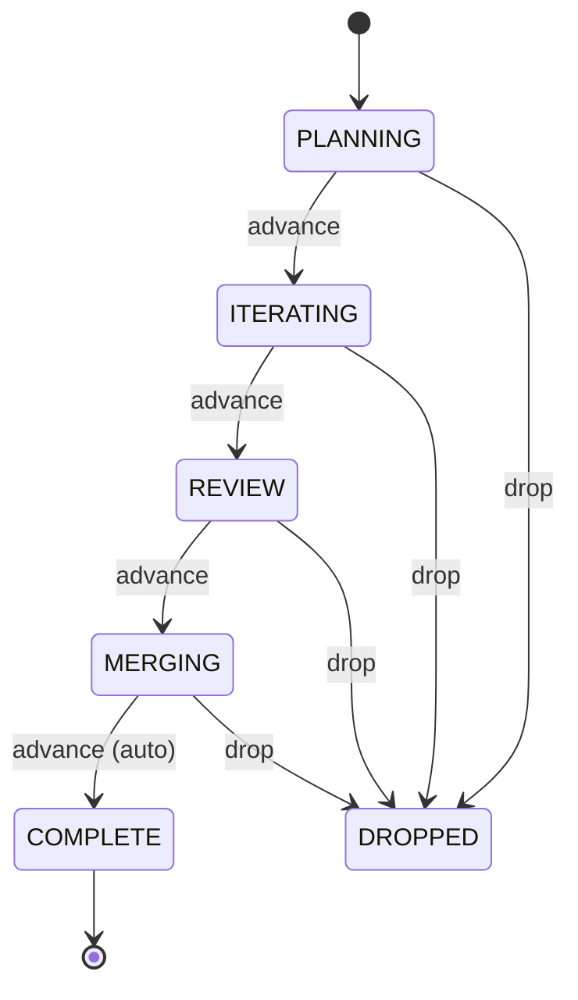

# panopticon

Run a fleet of coding agents across isolated tasks and **configurable workflows** — from one
seat of mission control.

A ground-up rewrite of the [cloude-cade](https://github.com/tildesrc/cloude-cade) prototype.
The full design lives on the [`design-docs`](../../tree/design-docs) branch (goals, parity
analysis, architecture, roadmap, and ADRs).

## What this is for

panopticon parallelizes and manages agent-driven development end to end: you create a task, an
agent plans it, writes the code and tests, opens a pull request, shepherds it through CI and the
merge queue, and lands it — while you watch a fleet of them from a single dashboard.

It draws a hard line between **foreground** work (a decision that's yours to make) and
**background** work (the agent runs autonomously). Every task carries a **turn** marker — agent
or you — and a **blocked** marker for when it's waiting on something external. The dashboard
colors them so you can see, at a glance, exactly which tasks want you and which are humming along
on their own.

> **The one rule that matters most — the determinism invariant.** The control plane makes **no
> LLM calls**. Every LLM call happens **inside a task container**. The task service, the runner,
> and the dashboard never call a model; only the agent in the container does.

## Architecture in one paragraph

A deterministic control plane (the **task service**) owns task state and drives a per-workflow
state machine; it is the sole DB authority. A per-machine **session service** (the runner) claims
new tasks and spawns a container for each — a self-contained git clone on its own branch — plus
the host tmux sessions you attach to. A **terminal controller** runs the dashboard you steer it
all from. Tasks talk back over a REST + MCP surface. See [`CLAUDE.md`](CLAUDE.md) for the
operating manual and the `design-docs` branch for the full picture.

## Quickstart

### Prerequisites

- **Docker** — task containers run here.
- **`uv`** — Python venv + dependency manager (the `Makefile` wraps it).
- **`gh`** — the GitHub CLI, authenticated to your forge; the agent drives all PR/CI/merge work
  through it.
- **`git`**.
- **`claude`** — the [Claude Code](https://claude.com/claude-code) CLI the in-container agent
  execs.

### One-time setup

```sh
make sync                 # create the venv and install dependencies
make build                # build the base task-container image (panopticon-base)
panopticon login <repo>   # populate the repo's credentials volume interactively
```

`panopticon login` writes into a **per-repo** credentials volume, so a task only ever sees its
own repo's secrets (ADR 0007). `make check` runs the typecheck + test suite (what CI runs), and
`make help` lists every target.

### Bring it up

```sh
make panopticon       # task service + runner + dashboard supervisor
make panopticon-down  # stop everything it started
```

`make panopticon` brings up the whole system on a dedicated tmux server (`-L panopticon`): a
background **`service`** session (the task service), a background **`runner`** session
(`python -m panopticon.sessionservice.host` — spawns a container per new task and provisions it),
and the foreground **dashboard supervisor** (`panopticon console`). Need just one piece?
`make serve` runs the control plane alone; `make dashboard` runs the dashboard once without the
attach loop.

### The workflow at a glance

Built-in forge workflows walk a task from an idea to a merged PR:



Forward transitions are **user-driven**: `advance` starts a new agentic turn and is gated on the
state's responsibilities. Only `MERGING → COMPLETE` auto-advances (the agent owns landing the
PR). `drop` is the universal escape hatch from any non-terminal state. The **`REVIEW`** stage
above belongs to **`GithubPeerReviewed`** (a human reviews the PR); **`GithubSelfReviewed`** is
the same lifecycle with `REVIEW` omitted — you self-review and advance straight to `MERGING`.

### Your first task

1. **Create it.** In the dashboard, press `n` — pick the repo, pick a workflow, type a
   description.
2. **The runner takes over.** It claims the task, spawns its container, and pre-fills the agent's
   input box with your description.
3. **The agent plans and names the task.** When it has a plan, it runs `/provision` to set a
   slug; the session service then branches the task's clone to `panopticon/<slug>` and points
   `origin` at the forge.
4. **Iterate.** Press `t` to attach to the task's container session and converse with the agent
   as it works.
5. **Ship.** The agent implements, runs `/open-pr` to open a draft PR, then `/babysit-ci` to
   watch the checks and fix what breaks — autonomously, until they're green.
6. **Advance.** `/advance` walks the states; at `MERGING` the agent runs `/babysit-merge` to add
   the PR to the merge queue and re-queue it if it gets ejected.
7. **It lands.** The task reaches `COMPLETE` once the PR merges.

## The host side

The host is mission control; the work happens in containers. `make panopticon` runs the
`service` and `runner` sessions in the background on the `-L panopticon` tmux socket and puts the
**dashboard** in front of you. The runner spawns each task's session on that *same* socket, so
from the dashboard `t` reaches it: the dashboard detaches, the supervisor attaches your terminal
to the task's container, and when you detach (`C-b d`) it drops you straight back on the live
dashboard. `s` jumps to the task-service session, `u` to the runner.

```
 panopticon ─ tasks                                       [n]ew  [t]attach  [?]help

  STATE       WHO       SLUG                      REPO          PR
 ─────────────────────────────────────────────────────────────────────────────────
  MERGING     ●agent    fix-login-redirect        acme/webapp   #218
  REVIEW      ●user     add-rate-limiter          acme/webapp   #214
  ITERATING   ●agent    readme-adapt-panopticon   panopticon    #220
  ITERATING   ⚑blocked  flaky-test-quarantine     acme/api      #207
  PLANNING    ●agent    cache-warmup-job          acme/api      —

  ● agent   ● user   ⚑ blocked
```

## Tasks & state

Tasks live in the **task service**, not in files: a structured store (SQLite to start,
backend-agnostic) that is the single writer of task state (ADR 0006). A task's identity is its
internal `id`; the human-readable **`slug`** is a label, set from inside the container when the
agent provisions. Every state transition is recorded in the task's history.

Free-form documents — the **plan**, notes — are **artifacts**: file-backed and reachable over
REST, the filesystem, MCP, and the dashboard (`a` lists a task's artifacts). The plan you see in
`PLANNING` is a `plan.md` artifact the agent writes.

## Workflow states

| State | What happens | Can move to |
| --- | --- | --- |
| `PLANNING` | The agent gathers requirements and writes the plan artifact. | `ITERATING`, `DROPPED` |
| `ITERATING` | The agent implements, tests, opens the PR, and gets CI green. | `REVIEW` *(peer)* / `MERGING` *(self)*, `DROPPED` |
| `REVIEW` | A human reviews the PR *(GithubPeerReviewed only)*. | `MERGING`, `ITERATING`, `DROPPED` |
| `MERGING` | The agent adds the PR to the merge queue and lands it. | `COMPLETE`, `DROPPED` |
| `COMPLETE` | Merged. Terminal. | — |
| `DROPPED` | Abandoned. Terminal. | — |

Forward moves are user-driven and gated on the current state's **responsibilities** — concrete
obligations the agent fulfils (plan written, tests pass, PR updated…) before `advance` will fire.
You're never boxed in: a **free move** (`set_state`) can send a task to *any* state directly,
bypassing the declared graph and the gate — that's how "back to coding" is just a move to
`ITERATING`. **GithubSelfReviewed** is **GithubPeerReviewed** minus the `REVIEW` stage; pick it
when you review your own work.

## Who has the ball

Two orthogonal markers track who's responsible for a task right now:

- **`turn`** — `agent` or `user`. It flips *within* a state as work changes hands: the agent's
  stop hook sets the turn to you; your next prompt hands it back. The agent flips its own turn
  but does **not** advance the state (the one exception is the agent-owned `MERGING → COMPLETE`).
- **`blocked`** — a deliberate "waiting on something external" marker the agent sets and clears
  explicitly. It's independent of the turn and survives turn flips.

The dashboard colors both, so foreground tasks (your turn) stand out from background ones.

## Workflows are code

This is the headline difference from the prototype: a workflow is a **`Workflow` subclass** whose
states are nested, declarative `State` classes. The lifecycle is code — transitions, the actor
who holds the turn, the responsibility gates — not hardcoded control flow (ADR 0004). Workflows
are **discovered** from the built-in package plus an optional path: drop a module in and it
registers, no core change. The built-ins:

- **`GithubPeerReviewed`** — the full forge lifecycle with a human `REVIEW` stage.
- **`GithubSelfReviewed`** — the same, minus `REVIEW`; you self-review.
- **`Orchestrator`** — an agent that creates and pre-plans *other* tasks.
- **`Spike`** — a minimal free-form seed workflow.

`GithubPeerReviewed` and `GithubSelfReviewed` share a `GithubForgeWorkflow` base that supplies the
`gh` tooling and forge skills.

## The dashboard

`panopticon console` (or `make panopticon`) runs the dashboard; it auto-refreshes from the task
service over REST. Keys:

| Key | Action |
| --- | --- |
| `t` | Attach to the task's container tmux session |
| `n` | New task (pick repo → workflow → describe) |
| `x` | Drop the highlighted task |
| `/` | Search tasks as you type (`Esc` clears) |
| `d` | Show/hide the detail pane |
| `a` | List the task's artifacts |
| `p` | Open the task's URL in the browser |
| `r` | Refresh from the task service now |
| `R` | Respawn a down task (release its claim) |
| `g` | Repo config (list / create / edit repos) |
| `s` | Switch to the task-service session |
| `u` | Switch to the session-service (runner) session |
| `?` | Full keymap |
| `q` | Quit |

## Skills

Where the prototype had host-side slash commands, panopticon has **skills**: agent-driven
procedures rendered into the container, layered on top of the core operations (`advance`,
`drop`). The agent invokes them from its session; you can ask it to. Every task gets the agnostic
provisioning skill; the forge workflows add the rest:

- **`/provision`** — name the task (set its slug) so the session service creates the branch.
  Exposed on every task.
- **`/advance`** — apply the workflow's `advance` operation; surfaces unmet responsibilities.
- **`/drop`** — drop the task from any non-terminal state.
- **`/open-pr`** — push the branch and open a **draft** PR against the repo's base branch.
- **`/babysit-ci`** — watch the PR's checks, resolve base conflicts, and fix failures until
  green — at no token cost while it waits.
- **`/babysit-merge`** — add the PR to the merge queue, re-queue on transient ejections, and kick
  back to `ITERATING` on a genuine blocker.

The `Orchestrator` workflow additionally exposes a spawn-task skill for creating new tasks.

## Per-repo configuration

A **repo** holds *references* to its secrets, never the values: an `env_file` (API-key env file)
and a `creds_volume` (the OAuth creds volume `panopticon login` populates). The runner injects
each repo's own secrets at launch, so tasks stay isolated (ADR 0007). A repo also carries an
`image_layer` — a Dockerfile fragment the runner composes onto base → workflow → **repo** to bake
in the repo's toolchain (ADR 0005) — and a `capabilities` opt-in map for elevated container
privileges (e.g. Docker-in-Docker), off by default.

## Internals & where to go next

- [`CLAUDE.md`](CLAUDE.md) — the operating manual: the determinism invariant, the module map, and
  conventions.
- The [`design-docs`](../../tree/design-docs) branch — GOALS, PARITY, ARCHITECTURE, ROADMAP, and
  the ADRs (`docs/decisions/`).

Humans normally don't need any of that to drive panopticon — the dashboard and the agents do the
work.

## Development

```sh
uv sync                     # create the venv and install dev deps
uv run pytest               # run tests
uv run mypy -p panopticon   # type-check (strict)
make check                  # typecheck + tests, exactly what CI runs
```
